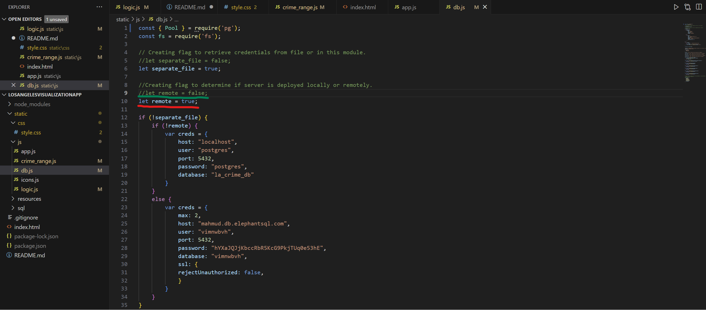

# Los Angeles County Crime Mapping Application

## Overview and Purpose
The Los Angeles Crime Mapping application is a dynamic web tool for visualizing crime data and the locations of McDonald's and other popular businesses in Los Angeles. Built with LeafletJS, MarkerCluster, and D3 for the frontend, and powered by NodeJS and PostgreSQL on the backend, it offers an interactive map displaying comprehensive information on crime incidents and business establishments.

For demonstration purposes, the application features crime data from Los Angeles County restricted to the period between September 1, 2023, and December 26, 2023, showcasing the web application's capabilities.

This application is collaborative work to fulfill the Project 3 requirement for UCB Extension Data Bootcamp.

## Data Ethics and Considerations

In adherence to the [California Consumer Privacy Act (CCPA)](https://oag.ca.gov/privacy/ccpa), our application is committed to the following ethical standards:

We utilize data that is publicly accessible from the Los Angeles Open Data Portal, specifically "Crime Data from 2020 to Present" and "Listing of Active Businesses." This data is used solely for informational and educational purposes, and is provided as-is without any warranty. Additionally, our application does not collect personal data from its users.

We are committed to protecting individual privacy and confidentiality. The application is designed to prevent the identification of individuals, particularly in the crime data, maintaining privacy and data anonymization in line with CCPA guidelines, as established by the [data sources](https://data.lacity.org/).

## Features
* Interactive map with crime data and McDonald's locations.
* Dynamic data visualization using LeafletJS 1.9.4, MarkerCluster 1.7.1, and D3 libraries
* Customizable map icons and popups for enriched user experience.
* Filters for crime types, date ranges, and specific areas.*

### Frontend
LeafletJS 1.9.4: JavaScript library for responsive maps
Leaflet.MarkerCluster 1.7.1: Manages large numbers of map markers
D3: A powerful JavaScript library for manipulating documents based on data
Geolib: A library that provides geospatial operations
Plotly: A data visualization library for JavaScript

### Backend
* **PostgreSQL** Database
    * Crime Data: Derived from the [Los Angeles Open Data Portal](https://data.lacity.org/Public-Safety/Crime-Data-from-2020-to-Present/2nrs-mtv8/about_data)
    * Los Angeles Business Aggragate Data, also from [Los Angeles Open Data Portal](https://data.lacity.org/Administration-Finance/Listing-of-Active-Businesses/6rrh-rzua/about_data)
* **NodeJS** Libraries:
    * **fs** 0.0.1-security: File system interactions.
    * **papaparse** 5.4.1: For CSV parsing (used for testing)
    * **pg** 8.11.3: PostgreSQL client.
    * **express** 4.18.2: Minimal Node JS web framework

## Getting Started

### Prerequisite
The following software **MUST** be installed in your local workstation before you can run the web application locally in your workstation.
* Local install 
    * [NodeJS](https://nodejs.org/en/learn/getting-started/how-to-install-nodejs)
    * [npm](https://docs.npmjs.com/downloading-and-installing-node-js-and-npm)
    * [PostgreSQL](https://www.postgresql.org/download/)
    * [pgAdmin4](https://www.pgadmin.org/download/)
* Remote Javascript libraries can be leveraged using the following libraries CDN sites. Check [index.html](index.html) for location of CDNs
    * Leaflet
    * MarkerCluster
    * Plotly
    * D3
    * Geolib

## Installing the web application in your local workstation
* Download the pre-requisite software packages indicated above (NodeJS, npm, PosgreSQL, and pgAdmin4)
* You can either fork from the repository or download zip file from [here](https://github.com/rabellan/LosAngelesVisualizationApp)
    * 
* Install the following packages using node package manager (npm)
    * express 4.18.2 
    * fs 0.0.1-security 
    * papaparse 5.4.1 
    * pg 8.11.3
    * <em><b>see example below:</b></em>
        * <code>npm install express@4.18.2 fs@0.0.1-security papaparse@5.4.1 pg@8.11.3</code>
            * 
* Unzip the web app file
* Build database in PostgreSQL using pgAdmin
    * Open **pgAmin4** and create "la_crime_db" database
        * 
    * Create **business** table
        * 
    * create **crime** table
        * 
    * Import **business_clean.csv**
        * 
    * Import **crime_four_month.csv**
        * 
* Set the "remote" flag to false by commenting out line 10 of db.js (red) and uncommenting line 9 of db.js (green).
    * 
* Start the app
    * Locate and **navigate to the local file system** containing the web application
        * Navigate to **/static/js** PATH in your local filesystem (ex. ../Projects/LosAngelesVisualizationApp/static/js)
        * 
    * Type <code>node app.js</code>
        * 
    * The web application should be running on http://localhost:3000 in your local workstation
        * 

## Usage

### How to Use The Los Angeles County Crime Mapping Application

#### To show the business locations and crime cluster in the map
* Step 1
    * Pick a date range in the **Crime Data Range** pull down menu on the upper left corner of the application
* Step 2
    * Pick a business from the checkbox menu on the upper right corner of the application

#### To show the crime statistics per business location
* Step 1
    * Click on a **business icon** in the map
* Step 2
    * Scroll down the sidebar to view the following crime statistics nearby the business location
    * Crime statistics breakdown:
        * Most Common Crimes and Count
        * Victim Enthnicity Breakdown
        * Victim Age Histogram
        * Victim Sex Breakdown

## Collaborators
* [Ahlden Brough](https://github.com/AhldenBrough)
* [Diahann Castellon](https://github.com/Diahann-c)
* [Leon Luong](https://github.com/leonluong1)
* [Roland Abellano](https://github.com/rabellan/)
* Steven Joseph Islava