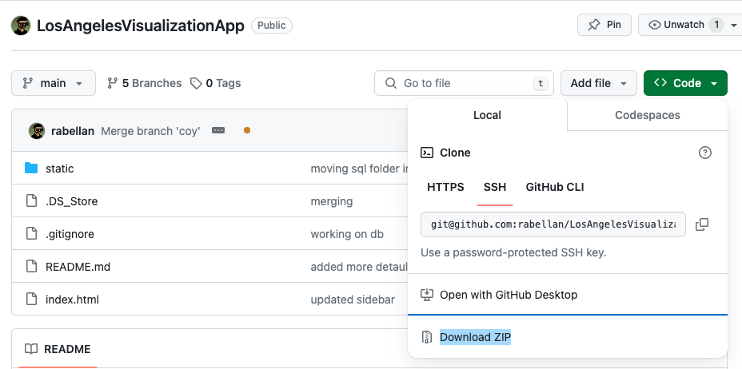
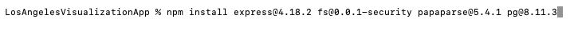
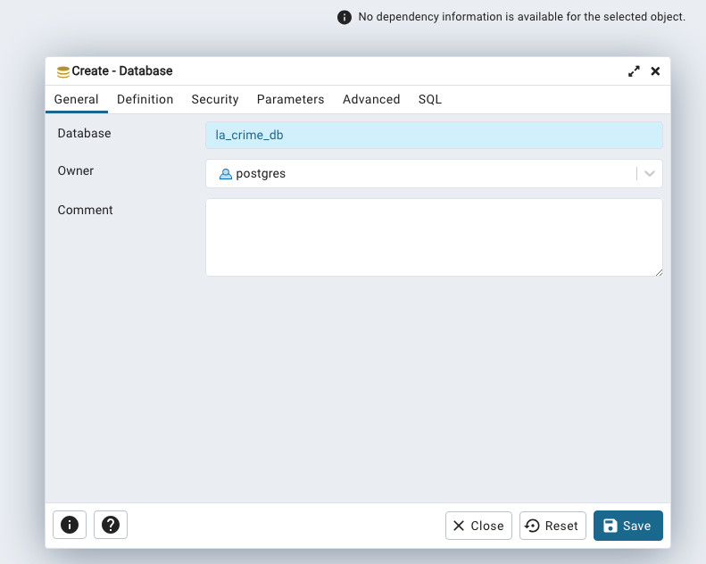
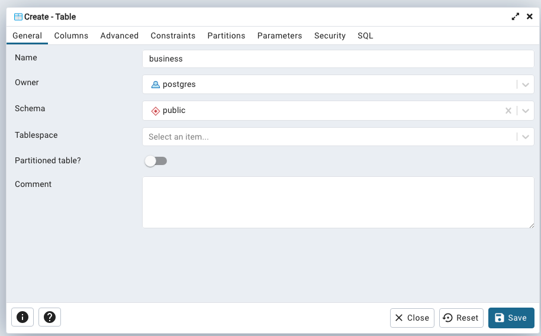
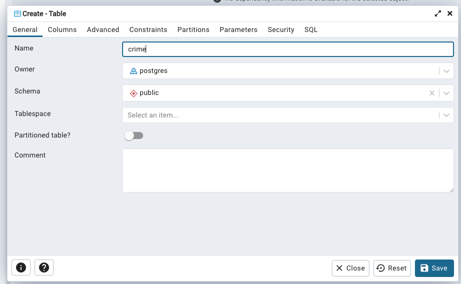
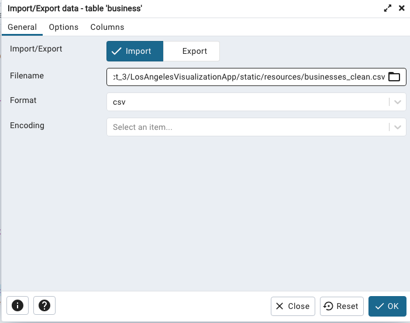
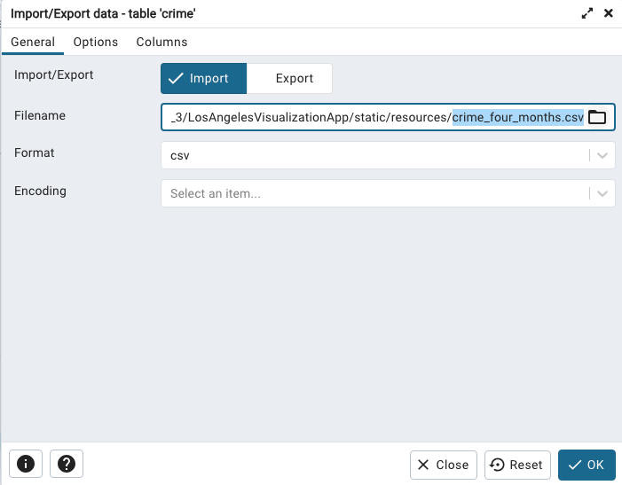
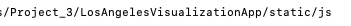
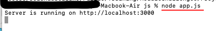
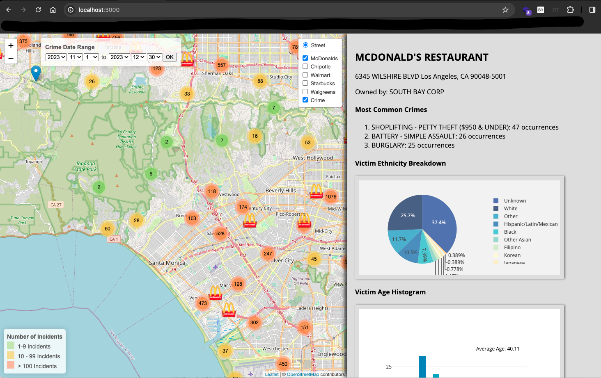

# Los Angeles County Crime Mapping Application

### Overview and Purpose
The Los Angeles Crime Mapping application is a web-based tool designed for visualizing crime data and McDonald's (and four other popular businesses) and locations in Los Angeles. It uses LeafletJS, MarkerCluster, D3 for the frontend while utilizing NodeJS and PostgreSQL for the backend to provide an interactive map that displays detailed information on crimes and business locations.

This application is collaborative work to fulfill the Project 3 requirement for UCB Extension Data Bootcamp.

### Data Ethics and Considerations

In compliance with the [**California Consumer Privacy Act (CCPA)**](https://oag.ca.gov/privacy/ccpa), we ensure the following:

This application utilizes publicly available data sourced from the Los Angeles Open Data Portal, specifically the "Crime Data from 2020 to Present" and "Listing of Active Businesses." The data used in this application is for informational and educational purposes only and is provided as a public service without warranty of any kind. 

The application relies on data provided by third-party sources (the County of Los Angeles). We do not guarantee the completeness, accuracy, content, or fitness for a specific purpose of the information provided. Our application does not collect personal data from users.

We respect individual privacy and confidentiality. Our application does not reveal or infer the identities of individuals, especially in crime data. The privacy concerns and anonymization in accordance with CCPA guidelines were inhereted from the source of the [data](https://data.lacity.org/). 

### Features
* Interactive map with crime data and McDonald's locations.
* Dynamic data visualization using LeafletJS 1.9.4, MarkerCluster 1.7.1, and D3 libraries
* Customizable map icons and popups for enriched user experience.
* Filters for crime types, date ranges, and specific areas.*

### Frontend
LeafletJS 1.9.4: JavaScript library for responsive maps
Leaflet.MarkerCluster 1.7.1: Manages large numbers of map markers
D3: A powerful JavaScript library for manipulating documents based on data
Geolib: A library that provides geospatial operations

### Backend
* **PostgreSQL** Database
    * Crime Data: Derived from the [Los Angeles Open Data Portal](https://data.lacity.org/Public-Safety/Crime-Data-from-2020-to-Present/2nrs-mtv8/about_data)
    * Los Angeles Business Aggragate Data, also from [Los Angeles Open Data Portal](https://data.lacity.org/Administration-Finance/Listing-of-Active-Businesses/6rrh-rzua/about_data)
* **NodeJS** Libraries:
    * **fs** 0.0.1-security: File system interactions.
    * **papaparse** 5.4.1: For CSV parsing (used for testing)
    * **pg** 8.11.3: PostgreSQL client.
    * **express** 4.18.2: Minimal Node JS web framework

## Getting Started

### Prerequisite
The following software **MUST** be installed in your local workstation before you can run the web application locally in your workstation.
* Local install 
    * [NodeJS](https://nodejs.org/en/learn/getting-started/how-to-install-nodejs)
    * [npm](https://docs.npmjs.com/downloading-and-installing-node-js-and-npm)
    * [PostgreSQL](https://www.postgresql.org/download/)
    * [pgAdmin4](https://www.pgadmin.org/download/)
* Remote Javascript libraries can be leveraged using the following libraries CDN sites. Check [index.html](index.html) for location of CDNs
    * Leaflet
    * MarkerCluster
    * Plotly
    * D3
    * Geolib

## Installing the web application in your local workstation
* Download the pre-requisite software packages indicated above (NodeJS, npm, PosgreSQL, and pgAdmin4)
* You can either fork from the repository or download zip file from [here](https://github.com/rabellan/LosAngelesVisualizationApp)
    * 
* Install the following packages using node package manager (npm)
    * express 4.18.2 
    * fs 0.0.1-security 
    * papaparse 5.4.1 
    * pg 8.11.3
    * <em><b>see example below:</b></em>
        * <code>npm install express@4.18.2 fs@0.0.1-security papaparse@5.4.1 pg@8.11.3</code>
            * 
* Unzip the web app file
* Build database in PostgreSQL using pgAdmin
    * Open **pgAmin4** and create "la_crime_db" database
        * 
    * Create **business** table
        * 
    * create **crime** table
        * 
    * Import **business_clean.csv**
        * 
    * Import **crime_four_month.csv**
        * 
* Start the app
    * Locate and **navigate to the local file system** containing the web application
        * Navigate to **/static/js** PATH in your local filesystem (ex. ../Projects/LosAngelesVisualizationApp/static/js)
        * 
    * Type <code>node app.js</code>
        * 
    * The web application should be running on http://localhost:3000 in your local workstation
        * 

### Collaborators
* [Ahlden Brough](https://github.com/AhldenBrough)
* [Diahann Castellon](https://github.com/Diahann-c)
* [Leon Luong](https://github.com/leonluong1)
* [Roland Abellano](https://github.com/rabellan/)
* Steven Joseph Islava